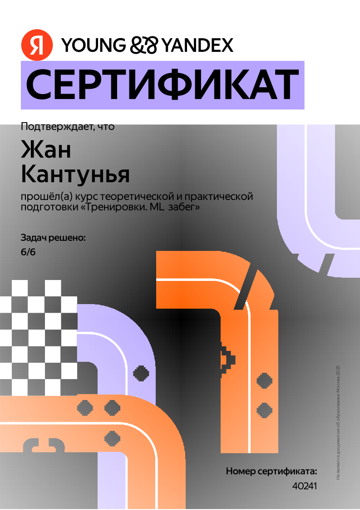

<h1 align="center">Hi, I'm Jean Cantuña 👋</h1>
<h3 align="center">ML Engineer & Neurotechnology Student @ ITMO University</h3>

  

---

### 🔍 Focus Areas  
- **Natural Language Processing (NLP)**  
- **Computer Vision (CV)**  
- **Deep Learning (DL)** & Diffusion Models  
- **Reinforcement Learning & Cognitive Systems (RL)**  
- **Neurotechnology** + Brain-Computer Interfaces  

---

### 💻 Tech Stack  

**Languages**:  
    

**ML / DL**:  
  

**Tools & Dev**:  
  

---

### 🎓 Currently  
- **B.Sc. in Neurotechnology & Programming** @ **ITMO University**  
- Building diffusion-based models for **image style transfer**  
- Optimizing ML pipelines (hyperparameter tuning, cross-validation, feature engineering)

### 📈 Github Statistics

  
  

---

### 📜 Certifications

  
  

  
  

  

